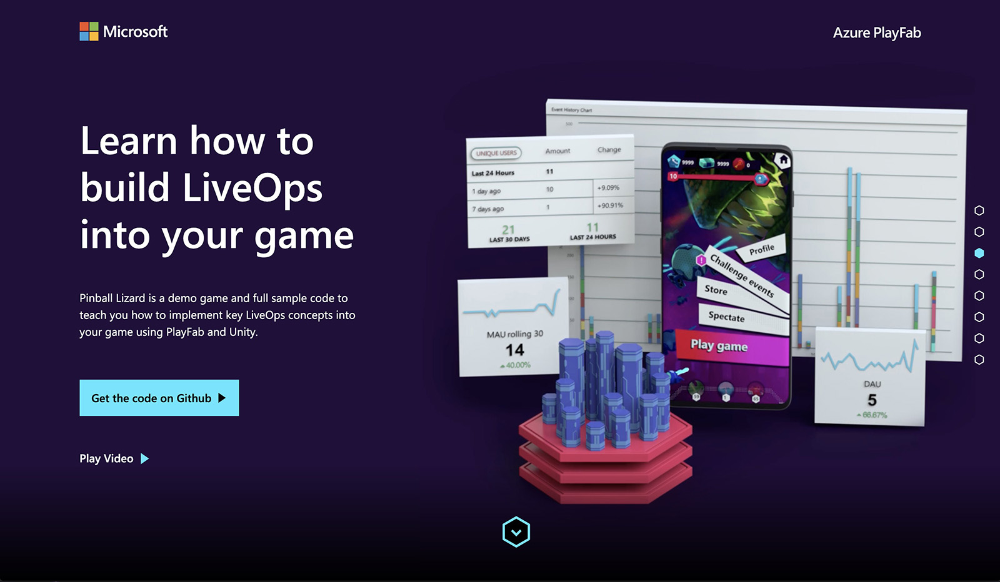
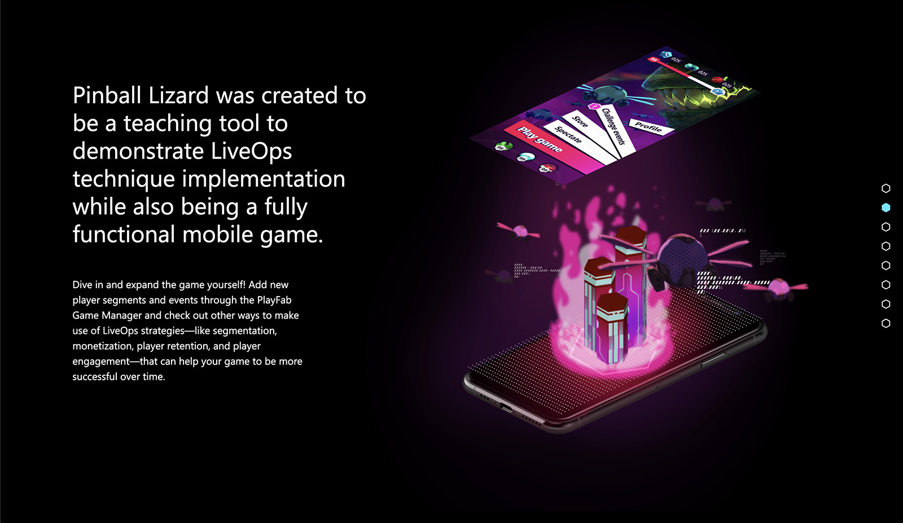
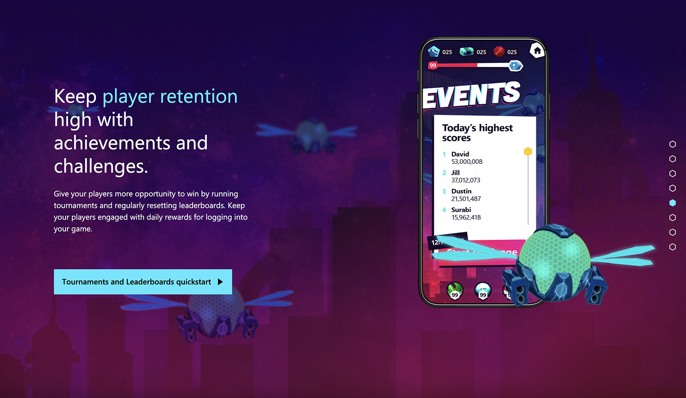

##### Description
With Microsoft's recent acquisition of Playfab, Microsoft wanted to showcase how Playfab's LiveOps capability integrates with Azure by creating a Pinball Lizard game. To gain the attention of developers, Pinball Lizard needed an interactive website to showcase the features of LiveOps.

##### My Role
I worked closely with a UI and motion designers build the UI and animations utilizing Vue.js, GSAP, PIXI.js and WebGL leading to the final build of the the interactive page.

##### Technologies
JavaScript, Vue.js, GSAP, PIXI.js, WebGL, HTML, SCSS, Bootstrap